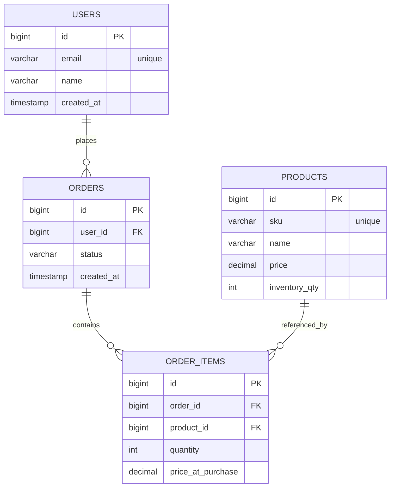

# Order Management API
Production-style REST API built with Spring Boot that models a real-world order lifecycle with transactional integrity, inventory enforcement, DTO separation, and structured error handling.

This project demonstrates backend architectural discipline beyond simple CRUD operations.

## Overview
The system manages:
- Users
- Products
- Orders
- OrderItems
- Inventory

It enforces business rules such as:
- Only NEW orders can be checked out
- Orders must contain at least one item before checkout
- Inventory is validated and decremented atomically
- State transitions are enforced at the service layer

- All rules are implemented inside transactional service boundaries.

## Architecture
This application follows a layered backend architecture:

### Controller Layer
Thin REST endpoints responsible only for HTTP concerns.

### Service Layer
Business rules, lifecycle validation, transaction boundaries.

### Repository Layer
Spring Data JPA persistence abstraction.

### Domain Layer
Relational modeling with explicit entity relationships.

### DTO Layer
Prevents entity leakage and defines stable API contracts.

### Exception Layer
Centralized JSON error handling via @ControllerAdvice.

##Architectural Highlights
- Service-level transaction management using @Transactional
- Explicit order lifecycle enforcement (NEW → PAID)
- Failure-path protection (no unintended database writes)
- Join-entity modeling (OrderItem) instead of naive many-to-many
- Monetary precision via BigDecimal
- Database-backed integration tests using Testcontainers
- Controller slice tests using @WebMvcTest
- Dockerized PostgreSQL for reproducible local development

## Data Model


OrderItem is modeled as a join entity to allow:

- Quantity
- Price snapshot at purchase time

This enables proper historical accuracy and avoids pricing mutation issues.

## Key Endpoints

Create Order
```bash
POST /orders/user/{userId}
```

Checkout Order
```bash
POST /orders/{orderId}/checkout
```

Add Item
```bash
POST /order-items?orderId=&productId=&quantity=
```

List Orders
```bash
GET /orders
```

## Example Checkout Response

```json
{
  "id": 1,
  "status": "PAID",
  "createdAt": "2026-03-01T01:15:00Z",
  "userId": 1
}
```

## Error Handling
Standardized error format:
```json
{
"timestamp": "2026-03-01T01:15:00Z",
"status": 400,
"error": "Bad Request",
"message": "Cannot checkout an empty order.",
"path": "/orders/1/checkout"
}
```

Business exceptions are translated via global exception handling.

## Testing Strategy

Integration Testing
- Real PostgreSQL via Testcontainer
- Full Spring context (@SpringBootTest)
- Transaction validation
- Side-effect verification

Controller Testing
- @WebMvcTest
- Service mocking
- HTTP contract verification

Run test:

```json
./mvnw clean test
```

Docker must be running.

## Tech Stack 
- Java 21
- Spring Boot 4
- Spring Web
- Spring Data JPA
- Hibernate
- PostgreSQL
- Testcontainers
- JUnit 5
- Mockito
- Lombok
- Docker

## What This Demonstrates
- Understanding of layered backend architecture
- Proper transaction management
- Enforcement of domain invariants
- Clean API contract design
- Real database testing strategy
- Production-style error handling

## Future Enhancements
- Pagination and sorting
- Order total calculation
- Authentication and authorization
- CI pipeline integration