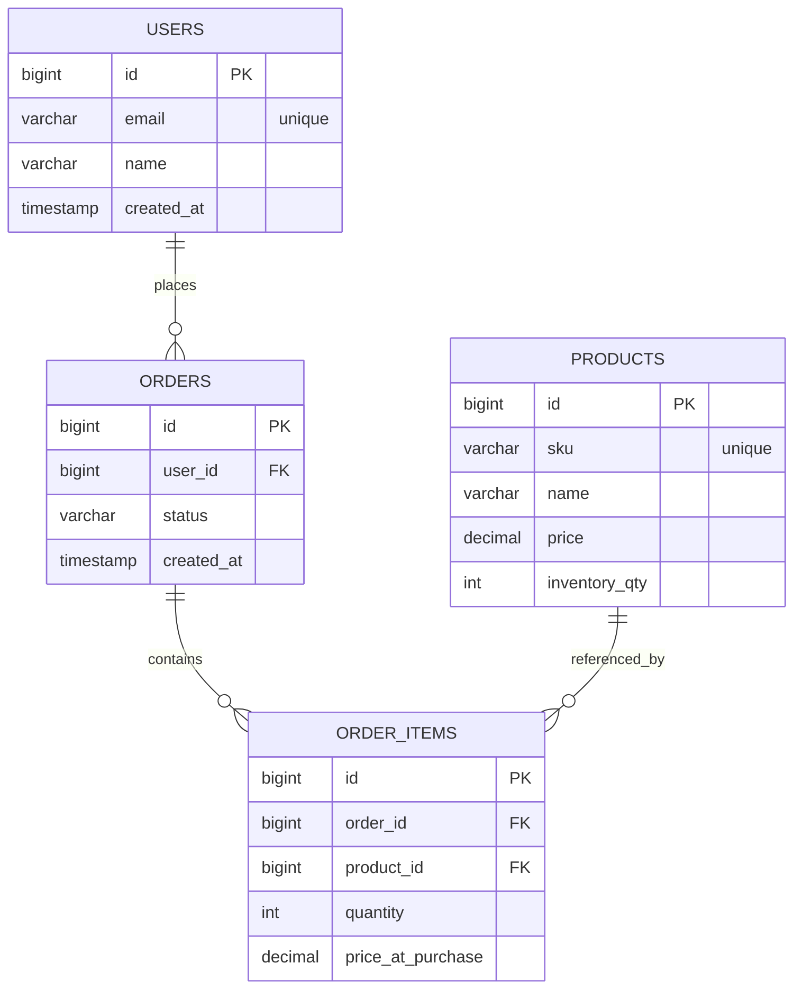

# Order Management API

A production-style RESTful backend built with Spring Boot for managing users, orders, products, and inventory with relational modeling and business validation.

---

## 🎯 Project Goals

This project is designed to:

- Demonstrate clean relational modeling using JPA
- Practice layered backend architecture
- Implement real-world business rules (inventory validation, order lifecycle)
- Avoid exposing entities directly via REST
- Incrementally evolve toward production-ready structure

## 🧠 Design Decisions

- OrderItem is modeled as a join entity rather than a direct many-to-many relationship to allow additional attributes (quantity, priceAtPurchase).
- BigDecimal is used for monetary values to avoid floating-point precision errors.
- Foreign key constraints enforce referential integrity.
- Docker is used to isolate database configuration from local machine dependencies.

## 🚀 Current Status (Week 2-DTO Layer Implemented)

✅ Dockerized PostgreSQL
✅ Spring Boot application running
✅ JPA domain model implemented
✅ Relational mappings (User → Order → OrderItem → Product)
✅ CRUD endpoints (Users, Products, Orders, OrderItems)
✅ DTO request/response pattern
✅ Global exception handling
✅ Standardized JSON API error responses
✅ Bean validation using jakarta.validation
✅ Service-layer business logic
✅ Inventory enforcement
✅ Transactional integrity using @Transactional
✅ Integration testing with Testcontainers
✅ Failure-path side-effect protection (no unwanted DB writes)

### 🔄 In Progress

- Service-layer business logic (inventory enforcement)
- Order lifecycle rules
- Pagination
- Integration testing

---

## 🧱 Architecture Overview

This project follows a layered architecture:

- **Controller Layer** – Thin REST endpoints
- **Service Layer** – Business logic and validation
- **Repository Layer** – Spring Data JPA persistence
- **Domain Layer** – Entity modeling and relationships
- **DTO Layer** – Controlled request/response models
- **Exception Layer** – Centralized API error handling
- **PostgreSQL** – Relational data store
- **Docker** – Containerized local development database

---

## 🗄 Data Model



## 🛠 Tech Stack

- Java 21
- Spring Boot
- Spring Data JPA
- PostgreSQL
- Docker
- Maven

## 🧪 Running Locally

1️⃣ Start database
```bash
docker compose up -d
```
2️⃣ Run application
```bash 
./mvnw spring-boot:run
```
3️⃣ Health check
```bash
curl http://localhost:8080/health
```

## 📌 Example Endpoints

- POST  /users
- GET   /users  
- POST  /products
- GET   /products
- POST  /orders/user/{userId}
- POST  /order-items?orderId=&productId=&quantity=
- GET   /orders

## 📦 DTO Example

Create User Request
```json 
{
"email": "user@example.com",
"name": "John Doe"
}
```

User Response
```json
{
  "id": 1,
  "email": "user@example.com",
  "name": "John Doe",
  "createdAt": "2026-02-26T18:10:00Z"
}
```

##  ❗API Error Handling
```json
{
  "timestamp": "2026-02-26T18:15:00Z",
  "status": 409,
  "error": "Conflict",
  "message": "Insufficient inventory. Have=1 requested=2",
  "path": "/orders/1/items"
}
```

## 🧪 Testing Strategy

Integration Testing
- Real PostgreSQL database via Testcontainers
- @SpringBootTest
- Transactional validation
- Inventory side-effect assertion
- Failure-path verification
- Custom exception verification


```bash
./mvnw clean test
```

## 📈 Roadmap

-[x]Core domain modeling
-[x]DTO pattern
-[x]Global exception handling
-[x]Inventory enforcement
-[x]Integration testing
-[x]OpenAPI documentation
-[ ]REST endpoint refinement for adding items
-[ ]MockMvc controller tests
-[ ]Order checkout workflow
-[ ]Pagination & sorting
