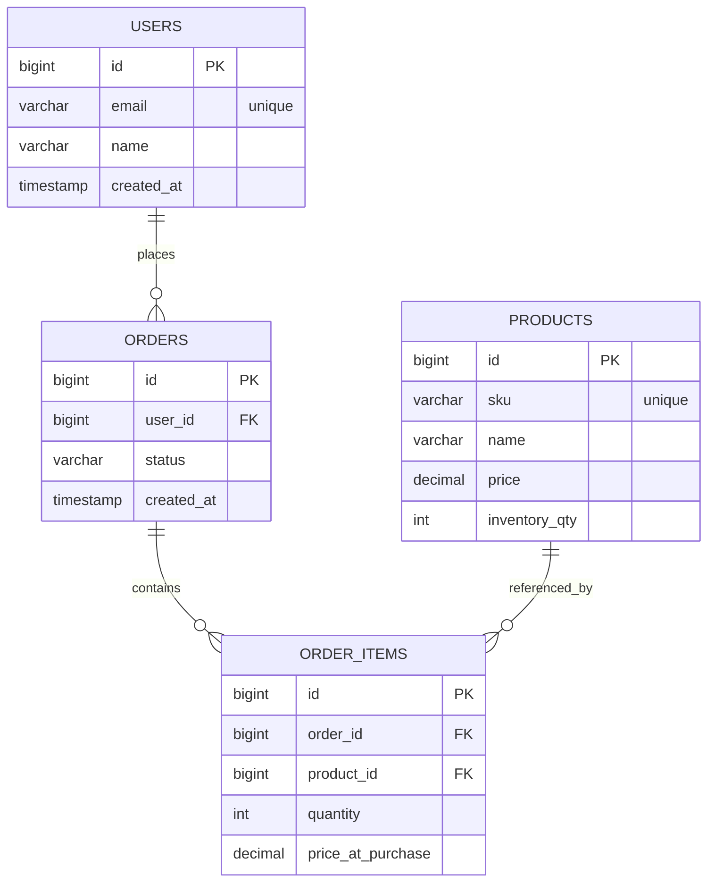

# Order Management API

A production-style RESTful backend built with Spring Boot for managing users, orders, products, and inventory with relational modeling and business validation.

---

## 🎯 Project Goals

This project is designed to:

- Demonstrate clean relational modeling using JPA
- Practice layered backend architecture
- Implement real-world business rules (inventory validation, order lifecycle)
- Avoid exposing entities directly via REST
- Incrementally evolve toward production-ready structure

## 🧠 Design Decisions

- OrderItem is modeled as a join entity rather than a direct many-to-many relationship to allow additional attributes (quantity, priceAtPurchase).
- BigDecimal is used for monetary values to avoid floating-point precision errors.
- Foreign key constraints enforce referential integrity.
- Docker is used to isolate database configuration from local machine dependencies.

## 🚀 Current Status (End of Week 1)

✅ Dockerized PostgreSQL  
✅ Spring Boot application running  
✅ JPA domain model implemented  
✅ Relational mappings (User → Order → OrderItem → Product)  
✅ Basic CRUD endpoints (Users, Products, Orders, OrderItems)  
✅ Database schema auto-generated and verified  
✅ Health endpoint available

⚠️ Service layer, validation, and DTOs will be implemented in Week 2.

---

## 🧱 Architecture Overview

This project follows a layered architecture:

- Controller Layer – REST endpoints
- Repository Layer – Spring Data JPA persistence
- Domain Layer – Entity modeling and relationships
- PostgreSQL – Relational data store
- Docker – Containerized local development database

---

## 🗄 Data Model



## 🛠 Tech Stack
- Java 21
- Spring Boot
- Spring Data JPA
- PostgreSQL
- Docker
- Maven

## 🧪 Running Locally

1️⃣ Start database
```bash
docker compose up -d
```
2️⃣ Run application
```bash 
./mvnw spring-boot:run
```
3️⃣ Health check
```bash
curl http://localhost:8080/health
```


## 📌 Example Endpoints

- POST /users
- POST /products
- POST /orders/user/{userId}
- POST /order-items?orderId=&productId=&quantity=
- GET /orders

##  ❗Example Error Response

## 🔜 Planned Enhancements

- Service layer abstraction
- Inventory validation logic
- Global exception handling
- DTO-based response models
- Pagination support
- Integration testing
- API documentation via Swagger