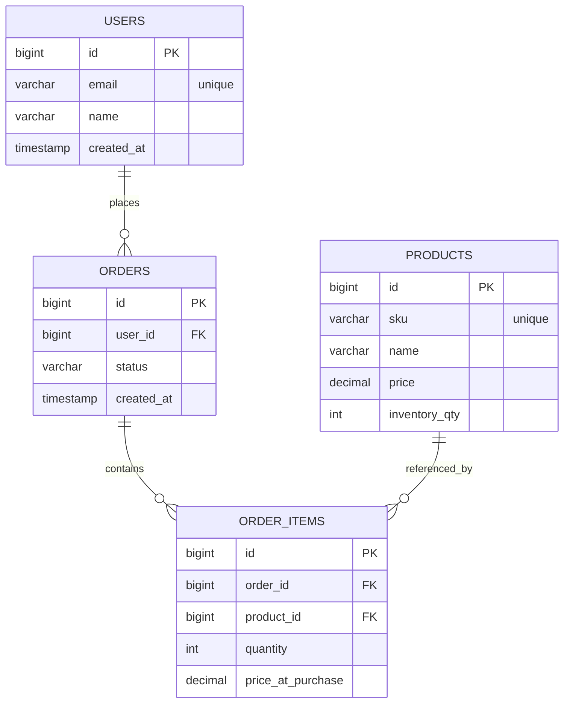

# ORDER MANAGEMENT API (Spring Boot + PostgreSQL)
A production-style RESTful backend built with Spring Boot for managing users, orders, products, and inventory with relational modeling and business validation.

## Tech Stack
- Java 21
- Spring Boot
- Spring Data JPA
- PostgreSQL
- Docker

## Data Model
```markdown
This ER diagram represents the relational data model for the Order Management API.

